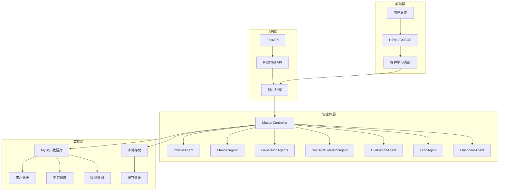

# 星识 (Star-Learn) 伴学系统 - Code Wiki

## 1. 项目概览

星识 (Star-Learn) 是一个基于多智能体架构的智能教学辅助系统，旨在为学生提供个性化的学习体验。系统结合了大语言模型、教育心理学和数据驱动的方法，实现了智能辅导、学习路径规划、苏格拉底式教学等功能。

### 主要功能
- 多智能体协同教学系统
- 个性化学习路径规划
- 苏格拉底式启发式教学
- 代码运行与评估
- 学习进度跟踪与分析
- 知识胶囊（闪卡）生成
- 多模态内容生成（文档、思维导图、视频等）
- 认知超载检测与干预
- 记忆回响与复习提醒

### 技术栈
- **后端**：Python, FastAPI
- **前端**：HTML, CSS, JavaScript
- **数据库**：MySQL
- **大模型**：讯飞API
- **其他**：Tailwind CSS, Mermaid（用于生成图表）

## 2. 项目架构

### 2.1 系统架构

星识系统采用分层架构设计，主要包含以下层次：

1. **前端层**：提供用户界面，包括各种学习页面和交互功能
2. **API层**：FastAPI实现的RESTful API，处理前端请求
3. **智能体层**：多智能体协同工作，实现核心教学逻辑
4. **数据层**：数据库和本地存储，管理用户数据和学习状态

### 2.2 智能体架构

系统采用多智能体架构，由MasterController统一管理和调度各个智能体：

| 智能体名称 | 角色 | 职责 |
|-----------|------|------|
| ProfilerAgent | 画像分析智能体 | 分析学生输入与遥测数据，更新6维学情画像，识别对话类型和情绪状态 |
| PlannerAgent | 路径规划智能体 | 根据画像动态规划学习路径，确定下一步学习内容和难度 |
| DocumentGeneratorAgent | 文档生成智能体 | 生成结构化的知识文档和教材内容 |
| MindmapGeneratorAgent | 思维导图生成智能体 | 生成Mermaid格式的思维导图和流程图 |
| ExerciseGeneratorAgent | 习题生成智能体 | 根据学习进度生成编程练习题和测验 |
| VideoContentAgent | 视频内容智能体 | 推荐和推送相关的视频学习资源 |
| ResourcePushAgent | 资源推送智能体 | 汇总所有生成智能体的输出，整合资源链接并推送 |
| EvaluationAgent | 评估智能体 | 计算学习评估指标，更新学情画像 |
| SocraticEvaluatorAgent | 苏格拉底评估与辅导智能体 | 通过苏格拉底式对话引导学生自主思考 |
| EchoAgent | 记忆回响智能体 | 检测遗忘节点并生成复习微挑战 |
| FlashcardAgent | 知识胶囊智能体 | 将章节知识压缩为记忆闪卡，辅助高效复习 |

## 3. 核心模块

### 3.1 主应用模块 (main.py)

主应用模块是系统的入口点，使用FastAPI实现RESTful API，处理前端请求并调用智能体系统。

**主要功能**：
- 提供用户认证（注册、登录）
- 处理学习评估和进度保存
- 实现多智能体聊天接口
- 代码运行和评估
- 教材链接管理
- 遥测数据收集
- 主动辅导流

**关键API端点**：
- `/api/register` - 用户注册
- `/api/login` - 用户登录
- `/api/chat` - 多智能体工作流
- `/api/v2/chat` - 增强版聊天接口
- `/api/v2/chat/stream` - 流式聊天接口
- `/api/run-code` - 运行代码
- `/api/grade-code` - 评估代码
- `/api/v2/flashcard/generate` - 生成闪卡
- `/api/v2/telemetry` - 遥测数据收集

### 3.2 智能体模块 (agents.py)

智能体模块实现了系统的核心教学逻辑，包含多个专用智能体和一个主控智能体。

**关键智能体**：
- **BaseAgent** - 所有智能体的基类，提供通用方法
- **ProfilerAgent** - 分析学生状态和对话类型
- **PlannerAgent** - 规划学习路径
- **SocraticEvaluatorAgent** - 实现苏格拉底式教学
- **MasterController** - 管理和调度所有智能体

**工作流程**：
1. 接收用户输入
2. ProfilerAgent分析用户状态和对话类型
3. PlannerAgent规划学习路径
4. 根据对话类型和学习风格选择合适的生成智能体
5. 生成智能体生成相应内容
6. EvaluationAgent评估学习效果
7. 返回结果给用户

### 3.3 状态管理模块 (state.py)

状态管理模块定义了系统中的各种状态数据结构，包括学生状态、学习画像、对话消息等。

**主要数据结构**：
- **StudentState** - 学生状态，包含对话历史、学习路径、画像等
- **LearningProfile** - 学习画像，包含认知水平、学习风格等
- **ChatMessage** - 对话消息
- **PathNode** - 学习路径节点
- **AgentStepLog** - 智能体执行日志

### 3.4 数据库模块 (db.py)

数据库模块负责与数据库交互，管理用户数据、学习进度和遥测数据。

**主要功能**：
- 用户管理（创建、查询、更新）
- 学习进度保存和加载
- 遥测数据存储
- 本地存储作为备份

### 3.5 大模型调用模块 (llm_stream.py)

大模型调用模块负责与讯飞API交互，实现文本生成和流式输出。

**主要功能**：
- 调用大模型生成文本
- 流式输出支持
- 错误处理和重试机制

### 3.6 任务管理模块 (task_manager.py)

任务管理模块负责管理异步资源生成任务，如思维导图、视频内容等。

**主要功能**：
- 任务调度和执行
- 任务状态查询
- 任务结果管理

### 3.7 主动辅导模块 (proactive_tutor.py)

主动辅导模块实现了主动推送消息和干预的功能，基于学生状态和行为触发。

**主要功能**：
- 连接管理
- 消息推送
- 学习困难检测和干预

## 4. 前端模块

系统前端由多个HTML页面组成，使用CSS和JavaScript实现交互功能。

### 4.1 主要页面

| 页面名称 | 功能 | 文件路径 |
|---------|------|----------|
| 登录页面 | 用户登录 | [login.html](file:///workspace/html/login.html) |
| 注册页面 | 用户注册 | [register.html](file:///workspace/html/register.html) |
| 个人中心 | 用户信息管理 | [personal.html](file:///workspace/html/personal.html) |
| 评估页面 | 学习风格评估 | [assessment.html](file:///workspace/html/assessment.html) |
| 中枢主页 | 系统主界面 | [hub.html](file:///workspace/html/hub.html) |
| 课程中心 | 课程管理 | [courses.html](file:///workspace/html/courses.html) |
| 代码练习 | 代码编写和运行 | [code.html](file:///workspace/html/code.html) |
| 学习进度 | 学习进度跟踪 | [progress.html](file:///workspace/html/progress.html) |
| 学习日历 | 学习计划管理 | [calendar.html](file:///workspace/html/calendar.html) |
| 智脑苏格拉底 | 苏格拉底式教学 | [socratic-ai.html](file:///workspace/html/socratic-ai.html) |
| 星云陈列室 | 学习资源展示 | [stellar-showcase.html](file:///workspace/html/stellar-showcase.html) |
| 心流共振仪 | 学习状态监测 | [flow-meter.html](file:///workspace/html/flow-meter.html) |
| 林场页面 | 学习成就展示 | [plant.html](file:///workspace/html/plant.html) |

### 4.2 前端功能

- 用户认证和个人信息管理
- 学习风格评估
- 智能聊天界面
- 代码编辑器和运行环境
- 学习进度可视化
- 学习日历和计划管理
- 资源浏览和管理
- 学习状态监测

## 5. 关键功能实现

### 5.1 多智能体工作流

系统的核心功能是多智能体协同工作流，通过多个专业智能体的协作，为学生提供个性化的学习体验。

**工作流程**：
1. 用户输入问题或请求
2. ProfilerAgent分析用户状态和对话类型
3. PlannerAgent根据用户画像规划学习路径
4. 主控智能体根据对话类型和学习风格选择合适的生成智能体
5. 生成智能体生成相应内容（文档、思维导图、代码等）
6. EvaluationAgent评估学习效果并更新用户画像
7. ResourcePushAgent汇总所有生成的内容和资源
8. 返回结果给用户

### 5.2 苏格拉底式教学

SocraticEvaluatorAgent实现了苏格拉底式教学方法，通过启发式提问引导学生自主思考。

**核心逻辑**：
- 分析学生的困惑点
- 生成层层递进的引导性问题
- 评估学生的回答
- 根据回答调整问题难度和方向
- 当学生连续错误时提供支持性内容
- 当学生理解后给予肯定和总结

### 5.3 个性化学习路径

系统根据学生的学习风格、认知水平和学习目标，动态生成个性化的学习路径。

**实现方法**：
- 基于学生的初始评估结果生成基础路径
- 根据学习进度和表现动态调整路径
- 考虑学习风格（视觉型、实践型、文字型）
- 考虑学习目标（考试、职业发展、兴趣等）
- 考虑可用学习时间和学习节奏

### 5.4 认知超载检测

系统通过遥测数据监测学生的学习状态，当检测到认知超载时进行干预。

**检测指标**：
- 区域停留时间
- 鼠标轨迹熵值
- 滚动速度
- 系统直接报告的超载分数

**干预措施**：
- 提供更基础的先导比喻
- 切换到更简单的相关知识点
- 提供视觉化辅助材料
- 调整教学节奏

### 5.5 记忆回响与复习提醒

EchoAgent检测遗忘风险节点并生成复习微挑战，帮助学生巩固记忆。

**实现方法**：
- 跟踪学习节点的完成时间
- 检测超过遗忘阈值的节点
- 为每个遗忘风险节点生成针对性的微挑战
- 推送复习提醒

### 5.6 知识胶囊（闪卡）生成

FlashcardAgent将章节知识压缩为记忆闪卡，辅助学生高效复习。

**生成规则**：
- 每张闪卡正面是明确的提问或填空
- 背面答案精炼，不超过200字
- 提示指出知识点的常见误解或易错点
- 每个章节生成至少10张闪卡
- 闪卡之间有递进关系（基础→核心→应用→易错→综合）

## 6. 技术实现细节

### 6.1 大模型集成

系统使用讯飞API作为大语言模型后端，实现智能对话和内容生成。

**调用方式**：
- 同步调用：适用于短文本生成
- 流式调用：适用于长文本生成，提供更好的用户体验

**参数配置**：
- 温度参数：控制生成内容的创造性
- 系统提示：定义智能体的角色和行为
- 用户提示：提供具体的任务描述

### 6.2 数据存储

系统使用MySQL数据库存储用户数据和学习进度，同时使用本地存储作为备份。

**数据库表结构**：
- `user` - 用户信息
- `user_profile` - 用户学习画像
- `learning_path` - 学习路径
- `telemetry_data` - 遥测数据
- `user_preferences` - 用户偏好设置

**本地存储**：
- `local_storage.json` - 存储临时数据和备份

### 6.3 前端实现

前端使用HTML、CSS和JavaScript实现，采用Tailwind CSS进行样式管理。

**主要技术**：
- Tailwind CSS：响应式布局和样式
- JavaScript：交互功能和API调用
- Mermaid：生成思维导图和流程图
- 原生JavaScript：实现各种前端功能

### 6.4 API设计

系统使用FastAPI实现RESTful API，遵循RESTful设计原则。

**API分类**：
- 用户管理API：注册、登录、个人信息更新
- 学习API：评估、进度保存/加载、聊天
- 代码API：运行、评估
- 资源API：闪卡生成、教材内容
- 遥测API：数据收集、查询

## 7. 项目运行

### 7.1 环境要求

- Python 3.7+
- MySQL数据库
- 讯飞API账号和API Key
- Node.js（用于Tailwind CSS）

### 7.2 安装步骤

1. 克隆项目代码
2. 安装Python依赖：`pip install -r requirements.txt`
3. 安装Node.js依赖：`npm install`
4. 配置环境变量：复制`.env.example`为`.env`并填写相应配置
5. 初始化数据库：运行`Navicat/setup_database.py`
6. 启动开发服务器：`python main.py`

### 7.3 访问方式

在浏览器中打开：`http://127.0.0.1:8000`

## 8. 项目配置

### 8.1 环境变量

系统通过`.env`文件配置环境变量：

- `XUNFEI_API_KEY`：讯飞API密钥
- `XUNFEI_API_URL`：讯飞API地址
- `MODEL_NAME`：使用的模型名称
- 数据库连接信息

### 8.2 配置文件

- `config/config.py`：系统配置
- `config/.env.example`：环境变量示例

## 9. 监控与日志

系统使用Python标准日志模块进行日志记录：

- `starlearn.stream`：流处理日志
- `starlearn.request`：请求处理日志
- `starlearn.master_controller`：主控智能体日志

## 10. 未来发展方向

1. **向量数据库集成**：替换本地知识库，提供更高效的知识检索
2. **多语言支持**：扩展系统支持多语言教学
3. **更丰富的多模态内容**：增加视频生成、3D模型等
4. **社区功能**：添加学生之间的交流和协作功能
5. **智能评估系统**：增强自动评估能力，支持更多类型的作业
6. **学习分析仪表板**：提供更详细的学习数据可视化
7. **移动应用**：开发移动端应用，支持随时随地学习
8. **AI教师助手**：为教师提供智能辅助工具

## 11. 总结

星识 (Star-Learn) 伴学系统是一个基于多智能体架构的智能教学辅助系统，通过整合大语言模型、教育心理学和数据驱动的方法，为学生提供个性化的学习体验。系统的核心优势在于：

- **多智能体协同**：多个专业智能体协作，提供全面的教学支持
- **个性化学习**：根据学生的学习风格和进度，动态调整教学内容和方法
- **苏格拉底式教学**：通过启发式提问，引导学生自主思考
- **多模态内容**：提供文档、思维导图、代码示例等多种形式的学习内容
- **认知状态监测**：实时监测学生的学习状态，及时干预认知超载
- **记忆强化**：通过记忆回响和知识胶囊，帮助学生巩固记忆

星识系统代表了教育科技的发展方向，通过人工智能技术提升教学效果，为学生创造更高效、更个性化的学习体验。